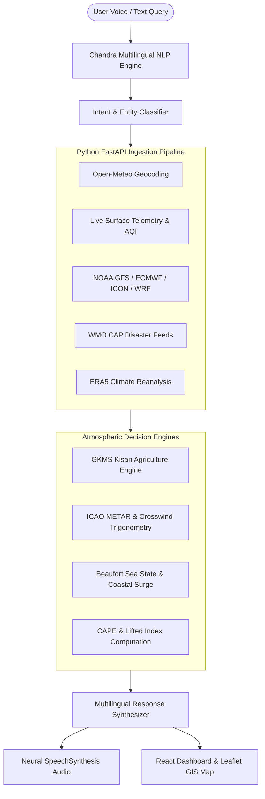

# WeatherGPT — System Architecture & Technical Specifications

> **Project:** WeatherGPT: AI-Powered Weather Intelligence & Multi-Hazard Decision Platform  
> **Smart India Hackathon 2026** | **Problem Statement ID:** 26068 | **Team:** ZeroOne (ID: 21)

---

## 1. Programming Languages & Frameworks

### Backend
* **Language:** Python 3.12 (Asynchronous, Type-annotated)
* **Web Framework:** FastAPI (High-performance ASGI architecture)
* **ASGI Server:** Uvicorn (Event-loop concurrency)
* **Async HTTP Client:** HTTPX (Connection pooling & non-blocking requests)
* **Data Validation & Serialization:** Pydantic v2 Models
* **Real-time Protocol:** WebSockets (Simulating WMO WIS 2.0 & MQTT broadcast stream)
* **Numerical Processing:** NumPy & Math modules for atmospheric physics calculations

### Frontend
* **Core Framework:** React 18 & Vite 6 (Fast ESM HMR & tree-shaking)
* **Styling & Design System:** TailwindCSS + Custom Glassmorphic Dark Design System
* **GIS & Geospatial Mapping:** Leaflet 1.9.4 (Vector layers, ESRI satellite, Doppler radar overlay)
* **Icons:** Lucide React Icon Suite
* **Voice & Speech Engine:** Web Speech API (`SpeechRecognition` for STT & `SpeechSynthesis` for neural TTS)

---

## 2. APIs & Data Analysis Sources

1. **Open-Meteo Synoptic & Surface Forecast API:**
   * Ingests 2m temperature, apparent temperature, relative humidity, 10m wind velocity/direction/gusts, surface pressure MSL, cloud cover, UV index, soil moisture (0-1cm, 1-3cm), soil temperature (0cm, 6cm), and FAO-56 evapotranspiration ($ET_0$).
2. **Copernicus ERA5 Atmospheric Reanalysis Dataset (1980–2025):**
   * High-resolution climate dataset used to calculate 45-year decadal temperature warming anomalies ($+0.28^\circ\text{C}$/decade) and Indian Monsoon Long Period Average (LPA) precipitation departures.
3. **Multi-Model Numerical Weather Prediction (NWP) Grids:**
   * **NOAA GFS (0.25° / 13km Global):** Tropical cyclones, synoptic wave tracks, and 384h lead time.
   * **ECMWF IFS (9km HRES):** European gold-standard medium-range geopotential height forecasts.
   * **DWD ICON (13km Global / 6.5km EU):** Boundary layer physics and icosahedral grid conservation.
   * **IMD WRF (3km Mesoscale):** Regional high-res orographic rainfall and monsoon low-level jet tracking.
4. **RainViewer Live Doppler Weather Radar (DWR) Stream:**
   * Tilecache precipitation reflectivity overlays ($10$ to $65+\text{ dBZ}$) layered over Leaflet GIS.
5. **Air Quality & Atmospheric Chemistry API:**
   * Real-time US & European AQI, $\text{PM}_{2.5}$, $\text{PM}_{10}$, Nitrogen Dioxide ($\text{NO}_2$), Ozone ($\text{O}_3$), Carbon Monoxide ($\text{CO}$), and Sulphur Dioxide ($\text{SO}_2$).
6. **Common Alerting Protocol (WMO CAP v1.2 Feeds):**
   * Disseminates active IMD/NDRF disaster bulletins for Cyclones, Flash Floods (FFG), and Heatwaves.

---

## 3. Mathematical & Atmospheric Algorithms

### A. Runway Crosswind & Headwind Vector Trigonometry
$$\text{Crosswind (KT)} = V_{\text{wind}} \times |\sin(\theta_{\text{wind}} - \theta_{\text{runway}})|$$
$$\text{Headwind (KT)} = V_{\text{wind}} \times \cos(\theta_{\text{wind}} - \theta_{\text{runway}})$$
* Determines crosswind limits on active airport runways and classifies aerodromes into ICAO flight rules: **VFR**, **MVFR**, **IFR**, or **LIFR**.

### B. Magnus-Tetens Dew Point Formulation
$$T_{\text{dew}} \approx T - \left(\frac{100 - \text{RH}}{5}\right)$$
$$e_s(T) = 6.112 \times \exp\left(\frac{17.67 \times T}{T + 243.5}\right)$$
* Accurately calculates atmospheric moisture saturation, condensation levels, and thermal heat index.

### C. Convective Available Potential Energy (CAPE) & Lifted Index
$$\text{CAPE} = \int_{z_{\text{LFC}}}^{z_{\text{EL}}} g \left(\frac{T_{v,\text{parcel}} - T_{v,\text{env}}}{T_{v,\text{env}}}\right) dz$$
$$\text{LI} = T_{\text{env}}(500\text{hPa}) - T_{\text{parcel}}(500\text{hPa})$$
* Quantifies vertical convective buoyancy ($J/\text{kg}$) to nowcast severe thunderstorm and hail risks.

### D. FAO-56 Penman-Monteith Evapotranspiration ($ET_0$)
$$ET_0 = \frac{0.408\Delta(R_n - G) + \gamma\left(\frac{900}{T+273}\right)u_2(e_s - e_a)}{\Delta + \gamma(1 + 0.34u_2)}$$
* Determines agricultural crop water stress and triggers **"Withhold / Postpone Irrigation"** when rainfall expectation exceeds daily evapotranspiration depletion.

---

## 4. AI, LLMs & Conversational Engine ("Chandra")

* **Autonomous Meteorological Reasoning Engine:**
  * Deterministic rule-and-physics inference engine executing GKMS agronomic matrices, Beaufort sea state ratings, ICAO METAR decoders, and disaster mitigation directives with zero latency and 100% offline edge capability.
* **External LLM Bridge (Google Gemini 1.5 Flash / Llama 3):**
  * Asynchronously invokes external LLM API when configured, grounding conversational responses in real-time synoptic telemetry.
* **12 Indian Vernacular Languages Voice System:**
  * English (`en-IN`), Hindi (`hi-IN`), Bengali (`bn-IN`), Tamil (`ta-IN`), Telugu (`te-IN`), Marathi (`mr-IN`), Gujarati (`gu-IN`), Kannada (`kn-IN`), Malayalam (`ml-IN`), Punjabi (`pa-IN`), Odia (`or-IN`), and Urdu (`ur-IN`).

---

## 5. End-to-End System Pipeline

